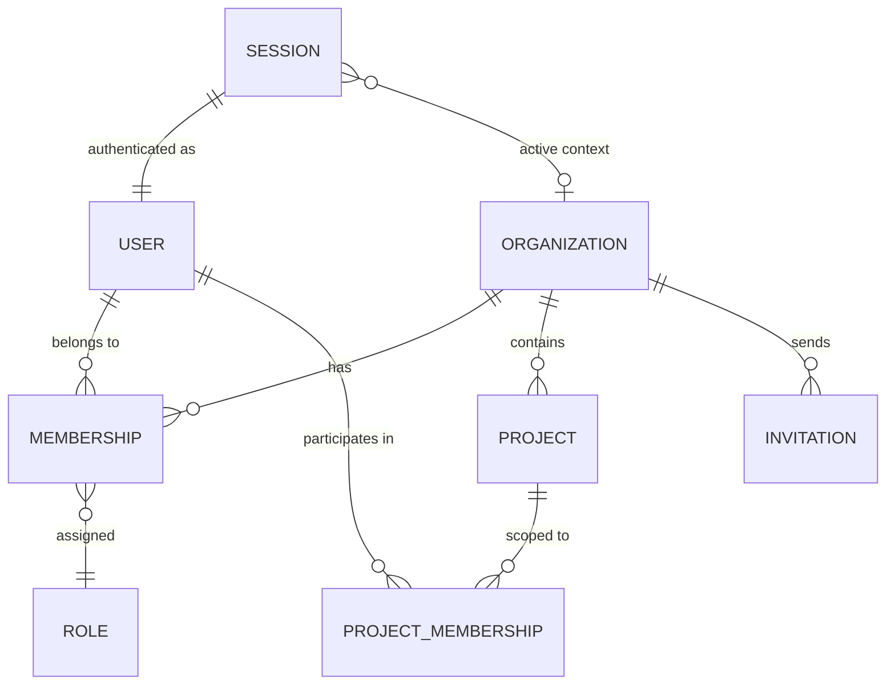

# Clarix Multi-Tenant Architecture — Gap Analysis & Roadmap

> **Scope**: How do Vercel, Clerk, WorkOS, etc. handle multi-user → multi-org → multi-project → roles? What does Clarix have today, what's missing, and how to close the gaps.

---

## 1. How Industry Leaders Structure Multi-Tenancy

### 1.1 The Universal Data Model

Every serious multi-tenant platform (Vercel, Clerk, WorkOS, Neon, Supabase) follows the **same 6-entity core**:



### 1.2 Entity-by-Entity Comparison

| Entity | Vercel | Clerk | WorkOS | Purpose |
|--------|--------|-------|--------|---------|
| **User** | Global identity, no org coupling | Global identity, can belong to 0..N orgs | Directory-synced identity | A person. Exists independently of any org. |
| **Organization** | "Team" — billing, domain, settings boundary | Org with metadata, logo, slug | "Organization" synced from IdP | Tenant boundary. All data is scoped here. |
| **Membership** | `org_member` join table (user ↔ team) | `organization_membership` (user ↔ org + role) | `organization_membership` | The **pivot** that links user → org with a **role**. |
| **Role** | `OWNER / MEMBER / VIEWER / DEVELOPER` | Configurable per-org roles | `admin / member` or custom roles | What a user can do *within* an org. |
| **Project** | Deployable unit inside a team | N/A (app-specific) | N/A | A sub-resource of the org. |
| **Invitation** | Email invite → pending membership | `organization_invitation` with status | Invite link / SCIM provisioning | Onboarding flow before membership exists. |

### 1.3 Key Architectural Principles

| Principle | How It Works | Why It Matters |
|-----------|-------------|----------------|
| **User ≠ Org Member** | Users exist globally. Membership links them to orgs. A user can be in 0, 1, or N orgs. | Allows user to switch orgs, get invited, leave. |
| **Role lives on Membership, NOT on User** | The same user can be `admin` in Org A and `member` in Org B. | Org-scoped permissions, not global identity. |
| **Session has active org context** | Session stores `active_organization_id`. API calls are scoped to this. | No need to pass org_id on every request. |
| **Invitation → Membership pipeline** | Invite is a pending record. Accept → creates membership. | Clean onboarding without pre-creating users. |
| **RLS / middleware enforces isolation** | Every query is filtered by `organization_id` from session. | Zero chance of cross-tenant data leaks. |
| **Org has its own settings** | Billing, branding, feature flags, timezone live on org. | Each customer can be configured independently. |

---

## 2. Clarix Current State — What You Have Today

### 2.1 Schema Snapshot

| Table | Org-Scoped? | Key Fields | Notes |
|-------|:-----------:|-----------|-------|
| `organization` | — (is the org) | `id, name, slug, license_number, dea_number, settings` | ✅ Well-defined org entity |
| `user` | ✅ `organization_id` FK | `id, email, name, role (enum), status, organization_id` | ⚠️ Role is a column ON the user, not on a membership |
| `session` | ❌ | `id, user_id, token, active_organization_id` | ⚠️ `active_organization_id` is `text`, not `uuid` FK |
| `account` | ❌ | `id, user_id, provider_id, password` | Better-Auth managed, OK |
| `verification` | ❌ | `id, identifier, value` | Better-Auth managed, OK |
| `batch` | ✅ | `organization_id, batch_number, formula_id, status...` | ✅ Properly scoped |
| `batch_step_record` | ✅ | `organization_id, batch_id, step_number...` | ✅ Properly scoped |
| `e_signature` | ✅ | `organization_id, user_id, meaning, table_name, record_id` | ✅ Insert-only, properly scoped |
| `inventory_item` | ✅ | `organization_id, name, sku, category...` | ✅ Properly scoped |
| `inventory_lot` | ✅ | `organization_id, inventory_item_id, lot_number...` | ✅ Properly scoped |
| `inventory_transaction` | ✅ | `organization_id, inventory_lot_id, type...` | ✅ Insert-only, properly scoped |
| `vendor` | ✅ | `organization_id, name, code...` | ✅ Properly scoped |
| `master_formula` | ✅ | `organization_id, name, version, status...` | ✅ Properly scoped |
| `formula_step` | ✅ | via formula FK | ✅ Transitively scoped |
| `formula_component` | ✅ | via formula FK | ✅ Transitively scoped |
| `room` | ✅ | `organization_id, name, iso_class...` | ✅ Properly scoped |
| `em_location` | ✅ | `organization_id, room_id...` | ✅ Properly scoped |
| `em_sample` | ✅ | `organization_id...` | ✅ Properly scoped |
| `equipment` | ✅ | `organization_id...` | ✅ Properly scoped |
| `cleaning_log` | ✅ | `organization_id...` | ✅ Properly scoped |
| `calibration_record` | ✅ | `organization_id...` | ✅ Properly scoped |
| `deviation` | ✅ | `organization_id...` | ✅ Properly scoped |
| `capa` | ✅ | `organization_id...` | ✅ Properly scoped |
| `training_record` | ✅ | `organization_id, user_id...` | ✅ Properly scoped |
| `lab_sample` | ✅ | `organization_id, batch_id...` | ✅ Properly scoped |
| `document` | ✅ | `organization_id...` | ✅ Properly scoped |
| `audit_trail` | ✅ | `organization_id, user_id, action...` | ✅ Insert-only, properly scoped |
| `notification` | ✅ | `organization_id, user_id...` | ✅ Properly scoped |

### 2.2 Auth & RBAC Snapshot

| Component | Current State | Details |
|-----------|:------------:|---------|
| Auth Provider | Better-Auth | Email + password, session-based, Drizzle adapter |
| Role Storage | `user.role` column | Single `user_role` pgEnum with 15 values |
| Role Scope | **Global on user** | Same role in all contexts — no per-org flexibility |
| Membership Table | ❌ **Missing** | User is hard-linked to a single org via `organization_id` FK |
| Invitation System | ❌ **Missing** | No invite/accept flow |
| Org Switching | ❌ **Missing** | `session.active_organization_id` exists but is `text` type, not enforced |
| RLS Policies | ❌ **Missing** | No Postgres-level row-level security; app-level scoping only |
| Permission Model | Documented only | RBAC matrix in `docs/rbac-and-screens.md` but not enforced in code |

### 2.3 Roles Defined (15 roles)

| # | Role Key | Tier | RBAC Doc Alias |
|---|----------|:----:|----------------|
| 1 | `admin` | 0 | admin |
| 2 | `pharmacist_in_charge` | 1 | pic |
| 3 | `pharmacist` | 1 | pharmacist |
| 4 | `production_manager` | 1 | prod_mgr |
| 5 | `qa_manager` | 2 | qa_manager |
| 6 | `qa_specialist` | 2 | qa_specialist |
| 7 | `compounding_supervisor` | 2 | (not in RBAC doc) |
| 8 | `procurement_manager` | 2 | procurement |
| 9 | `training_coordinator` | 2 | training_coord |
| 10 | `executive` | 2 | vp |
| 11 | `compounding_technician` | 3 | technician |
| 12 | `qc_technician` | 3 | qc_tech |
| 13 | `warehouse_clerk` | 3 | warehouse |
| 14 | `maintenance_technician` | 3 | maintenance |
| 15 | `read_only` | 4 | (viewer) |

---

## 3. Gap Analysis — Clarix vs. Industry Standard

### 3.1 Critical Gaps

| # | Gap | Severity | Current State | Required State | Impact |
|---|-----|:--------:|---------------|----------------|--------|
| **G1** | **No membership table** | 🔴 Critical | User has `organization_id` FK — hard-bound to 1 org | `organization_member` join table (user ↔ org ↔ role) | Blocks multi-org support entirely |
| **G2** | **Role lives on user, not membership** | 🔴 Critical | `user.role = 'qa_manager'` | `organization_member.role = 'qa_manager'` | User can't have different roles in different orgs |
| **G3** | **No invitation system** | 🟡 Major | Admin directly creates user in DB | `invitation` table with email, role, status, expiry | No self-service onboarding |
| **G4** | **No RLS policies** | 🟡 Major | App-level `WHERE org_id = ?` only | Postgres RLS enforcing `org_id = current_setting('app.org_id')` | Defense-in-depth missing; one bad query = data leak |
| **G5** | **Session org context is text, not FK** | 🟠 Moderate | `session.active_organization_id` is `text` | Should be `uuid` FK to `organization.id` | No referential integrity on active org |
| **G6** | **No org-level settings granularity** | 🟠 Moderate | `organization.settings` is a single JSONB blob | Typed settings table or strongly-typed JSONB schema | Can't validate org configs per deployment |
| **G7** | **No "project" concept inside org** | ⚪ Future | Not applicable yet | Multi-facility or multi-site support | Each 503B pharmacy = separate "project" under one org |
| **G8** | **Permission enforcement is docs-only** | 🟡 Major | RBAC matrix is in markdown, not middleware | Middleware/guard checking `session.role` against route | Any route is accessible to anyone with a session |

### 3.2 What's Already Good

| ✅ Strength | Details |
|------------|---------|
| **Every domain table is org-scoped** | All 20+ tables have `organization_id` FK — the hardest part is already done |
| **Org entity is well-defined** | `organization` has slug, license_number, DEA, settings — pharma-ready |
| **15-role enum is comprehensive** | Covers every persona in a 503B facility |
| **Audit trail is insert-only** | `audit_trail` and `e_signatures` are immutable — 21 CFR Part 11 compliant |
| **Better-Auth is session-based** | Session already has `active_organization_id` field — just needs proper FK |
| **Drizzle schema is composable** | `baseFields`, `orgFields`, `auditAtFields` patterns enable rapid schema extension |

---

## 4. Target Architecture — What To Build

### 4.1 Proposed New Tables

```
┌─────────────────────────────────────────────────────────────────┐
│                     PROPOSED NEW TABLES                         │
├─────────────────────────────────────────────────────────────────┤
│                                                                 │
│  ┌──────────────────────┐    ┌──────────────────────────────┐  │
│  │  organization_member │    │  organization_invitation     │  │
│  ├──────────────────────┤    ├──────────────────────────────┤  │
│  │ id            uuid   │    │ id              uuid         │  │
│  │ organization_id uuid │    │ organization_id uuid         │  │
│  │ user_id       uuid   │    │ email           text         │  │
│  │ role    user_role    │    │ role      user_role          │  │
│  │ is_owner     bool    │    │ status    invitation_status  │  │
│  │ invited_by   uuid    │    │ invited_by      uuid         │  │
│  │ joined_at    ts      │    │ token           text         │  │
│  │ created_at   ts      │    │ expires_at      ts           │  │
│  │ updated_at   ts      │    │ accepted_at     ts           │  │
│  └──────────────────────┘    │ created_at      ts           │  │
│                              └──────────────────────────────┘  │
│                                                                 │
│  UNIQUE(organization_id, user_id)                               │
│  UNIQUE(organization_id, email) on invitation                   │
└─────────────────────────────────────────────────────────────────┘
```

### 4.2 Schema Changes Summary

| Change | Table | Action | Details |
|--------|-------|--------|---------|
| **C1** | `organization_member` | **CREATE** | Join table: `user_id` + `organization_id` + `role` + `is_owner` |
| **C2** | `organization_invitation` | **CREATE** | Invite flow: `email` + `role` + `token` + `status` + `expires_at` |
| **C3** | `user` | **MODIFY** | Remove `organization_id` FK (user becomes org-independent) |
| **C4** | `user` | **MODIFY** | Remove `role` column (role moves to membership) |
| **C5** | `session` | **MODIFY** | Change `active_organization_id` from `text` → `uuid` FK to `organization` |
| **C6** | Better-Auth config | **MODIFY** | Add org plugin / extend `databaseHooks` to resolve role from membership |

### 4.3 How Each Flow Works After Migration

#### User Sign-Up / First Org

```
1. User registers     → user row created (no org link)
2. User creates org   → organization row created
3. System auto-joins  → organization_member row: (user, org, admin, is_owner=true)
4. Session updated    → session.active_organization_id = new org id
```

#### Inviting a Team Member

```
1. Admin sends invite → organization_invitation: (org, email, role='technician', status='pending')
2. Email link sent    → contains signed token
3. Recipient clicks   → if existing user → create membership; if new → sign up + create membership
4. Invitation status  → 'accepted', membership created, user sees org in switcher
```

#### Org Switching (Future Multi-Org)

```
1. User clicks org in dropdown → API: PATCH /session { active_organization_id: newOrgId }
2. Server validates            → check organization_member exists for (user_id, newOrgId)
3. Session updated             → new active org, new role resolved from membership
4. All queries scoped          → middleware injects org_id from session into every DB call
```

---

## 5. Before vs. After — Side-by-Side

| Aspect | 🔴 Before (Current) | 🟢 After (Target) |
|--------|---------|--------|
| **User ↔ Org link** | `user.organization_id` FK — 1:1 | `organization_member` table — M:N |
| **Role resolution** | `user.role` — global | `organization_member.role` — per-org |
| **Adding someone to an org** | Direct SQL insert into `user` with `organization_id` | Create invitation → accept → membership created |
| **Multiple orgs per user** | ❌ Impossible | ✅ User has row in `organization_member` per org |
| **User leaving an org** | Delete user entirely | Delete `organization_member` row; user still exists |
| **Org admin** | `role = 'admin'` on user | `is_owner = true` on membership |
| **Session scoping** | `active_organization_id` set but not validated | Validated against membership, enforced via middleware |
| **RLS** | None | Postgres policies on every table using `app.org_id` |
| **Permission checks** | Documentation only | Middleware guards checking `membership.role` against route |

---

## 6. Implementation Roadmap (Priority Order)

| Phase | Task | Effort | Depends On | Blocks |
|:-----:|------|:------:|:----------:|--------|
| **P0** | Create `organization_member` table in Drizzle schema | 2h | — | Everything |
| **P0** | Create migration to populate `organization_member` from existing `user.organization_id` + `user.role` | 1h | P0.1 | P1 |
| **P1** | Modify Better-Auth `databaseHooks` to resolve role from `organization_member` instead of `user.role` | 3h | P0 | P2 |
| **P1** | Fix `session.active_organization_id` → `uuid` FK | 1h | P0 | P3 |
| **P2** | Create auth middleware: extract `org_id` + `role` from session, inject into request context | 4h | P1 | P3 |
| **P2** | Build permission guard utility: `requireRole('qa_manager', 'admin')` for API routes | 3h | P1 | P3 |
| **P3** | Create `organization_invitation` table | 2h | — | P4 |
| **P3** | Build invite API: `POST /api/org/invite`, accept flow, reject flow | 4h | P3.1 | P4 |
| **P4** | Add org-switcher UI component (web + mobile) | 4h | P1, P2 | — |
| **P5** | Add Postgres RLS policies to all org-scoped tables | 6h | P1 | — |
| **P5** | Remove `user.role` and `user.organization_id` columns (final cleanup) | 2h | P0–P4 verified | — |

> [!IMPORTANT]
> **P0 and P1 are non-negotiable for a scalable multi-tenant product.** Everything else (invitation, RLS, org-switcher) is important but can ship incrementally.

---

## 7. Regulatory Consideration (503B Specific)

| Concern | Vercel/Clerk Don't Solve This | Clarix Must Handle |
|---------|--------|---------|
| **Separation of duties** | Generic RBAC | Batch execute ≠ review ≠ release must be **3 different users** |
| **E-Signature binding** | No concept | Signature must bind to `membership.role` at time of signing, not current role |
| **Qualification gating** | No concept | `compounding_technician` must have active `media_fill_qualified` to execute |
| **Audit trail immutability** | No concept | Role changes via membership must log to `audit_trail` with old/new values |
| **Per-facility licensing** | No concept | If multi-facility, each org needs its own `license_number`, `dea_number` |

> [!CAUTION]
> When migrating role from `user.role` → `organization_member.role`, you MUST snapshot the current role values into an `audit_trail` entry. FDA auditors may ask "when did this user's role change?" and you need the immutable record.

---

## 8. Decision Points For You

| # | Decision | Options | Recommendation |
|---|----------|---------|----------------|
| **D1** | Multi-org now or later? | (A) Support multi-org from day one  (B) Single-org only, but use membership table for clean separation | **B** — Build the membership table now, but enforce 1 org per user in the UI. Flip the switch later. |
| **D2** | Project concept (multi-facility)? | (A) Add `facility` table now  (B) One org = one facility for v1 | **B** — Don't over-engineer. Each 503B pharmacy is its own org. |
| **D3** | RLS or app-level only? | (A) Postgres RLS  (B) Middleware-only  (C) Both | **C** — Middleware for speed, RLS as defense-in-depth. |
| **D4** | Keep `user.role` as cache? | (A) Remove entirely  (B) Keep as denormalized cache of "primary" role | **A** — Single source of truth on `organization_member.role`. Caching causes drift. |
| **D5** | Better-Auth org plugin? | (A) Use official `@better-auth/organization` plugin  (B) Custom membership table | **B** — Your roles are too domain-specific for a generic plugin. |

---

*Generated: April 2, 2026 — Based on analysis of Clarix codebase at `/Users/nithin/Developer/Apps/fills2.0/clarix`*
